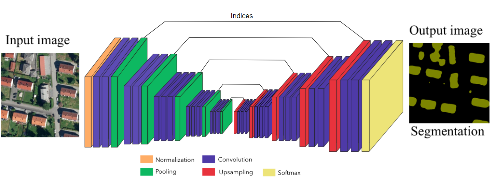
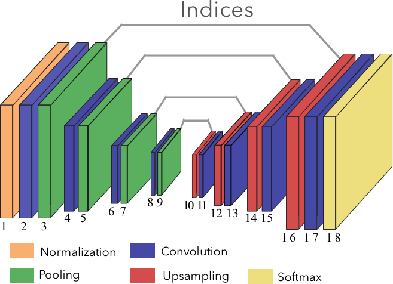
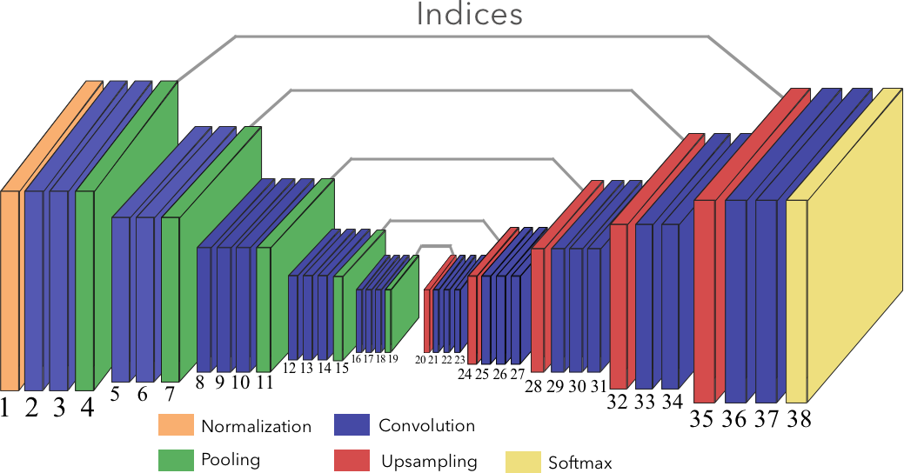
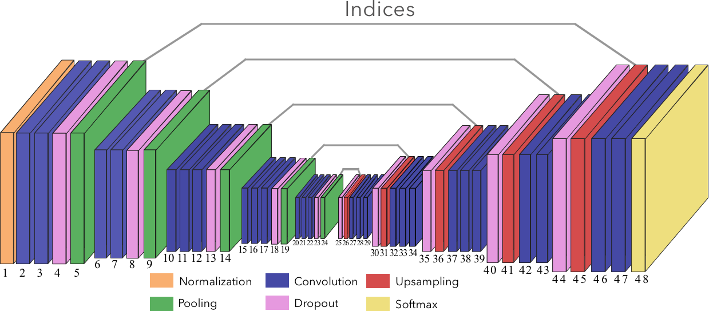
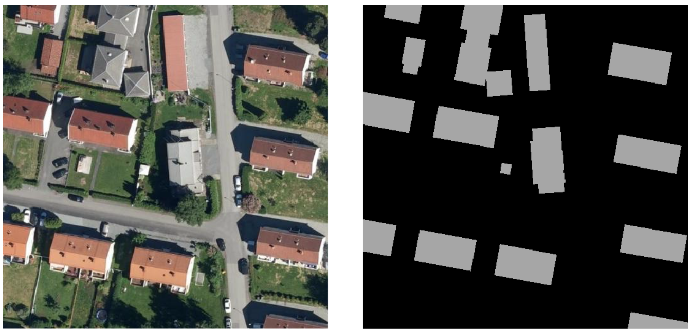
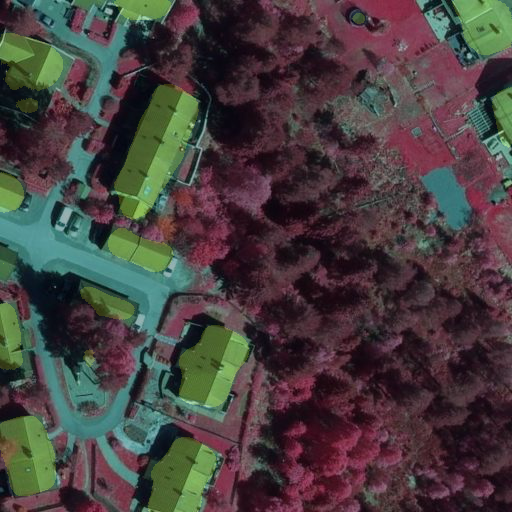
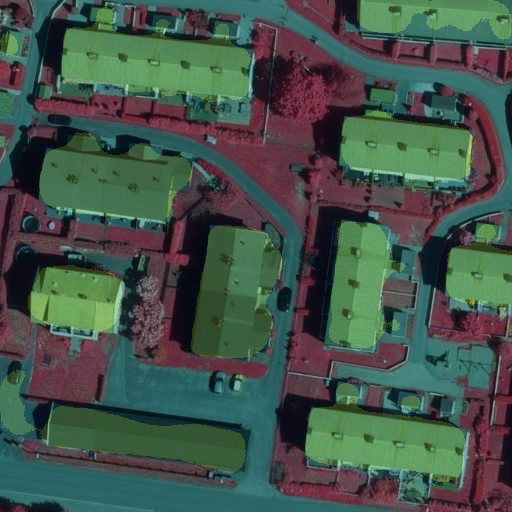
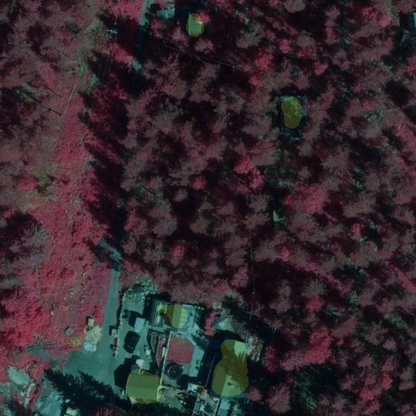

# SegNet --> AirNet
AirNet is a segmentation network based on [SegNet](https://mi.eng.cam.ac.uk/projects/segnet/), but with some modifications. The goal is to use the model to segment multispectral images, so that geographical information (e.g. building information) can be extracted. The model is implemented in [Tensorflow](https://www.tensorflow.org/).

## Recognition
- SegNet implementation by tkuanlan35: https://github.com/tkuanlun350/Tensorflow-SegNet.
- Unraveling method from mshunshin: https://github.com/mshunshin/SegNetCMR/blob/master/SegNetCMR/layers.py

## Architecture
*NB! If you are unfamiliar with how convolutional neural networks work, I have written a [blogpost](https://geoit.geoforum.no/2017/12/20/maskinlaering-flyfoto/) that explains the basic concepts.*

I've implemented four different version of the models:
- [AirNet-basic](#AirNet-basic)
- [AirNet-basic-dropout](#AirNet-Basic-dropout)
- [AirNet-extended](#AirNet-Extended)
- [AirNet-extended-dropout](#AirNet-Extended-dropout)

All the AirNet models have:
- an encoder-decoder structure with different number of layers for the different versions
- batch normalization with a moving avarage decay of 0.99
- usampling layers that use pooling indices from the maxpool in the encoder. The positions for the original pixels that are kept during maxpooling in the encoder is saved, and used in the decoder to place the pixels back to their original positions.

### Optimizers and initializers
Different optimizers and initializers have been tested on each of the models. The ones that were tested are listed below, and the ones that was chosen based on performance is given in the model description.

#### Optimizers:
- Stochastic gradient descent
- Adam
- Adagrad
- Momentum
#### Weight initializers:
- Variance scale
- Xavier

### AirNet Basic
- Four encoders and four decoders
- Stochastic gradient descent optimizer
- Xavier initializer

### AirNet Basic dropout
Same architecture as Basic, except for dropoutlayers that are added after the pooling layers, with a dropout rate of 0.5.

### AirNet Extended
The extended model is much larger and has 5 encoders and 5 decoders. It takes longer time to train, it is slower during inference, but achieves higher performance when trained sufficiently.

- Five encoder and decoders
- Adagrad optimizer
- Variance scale weight initializer

### AirNet Extended dropout
Same architecture as Extended, except for dropoutlayers that are added after the pooling layers, with a dropout rate of 0.5.

## Usage
### Requirements

- Tensorflow GPU 1.3.0
- Python 3.5

`pip install -r AirNet/requirements.txt`

### Run TensorBoard:
tensorboard --logdir=path/to/log-directory

## Dataset
To verify the model I used the CamVid dataset. This can be downloaded from: https://github.com/alexgkendall/SegNet-Tutorial, and used in the model by setting the correct paths and dataset size in [AirNet/\__init__.py](https://github.com/Norkart/autoKart/blob/master/AirNet/__init__.py)

The datasets of aerial images used to train and test the model is constructed through an automatic mapping of vector data and aerial images of Norway. Both a dataset with IR images, and with RGB images was constructed, both containing around 4500 images. The data is unfortunately not open source.

## Results
The IR images gave a small increase in performance, and examples of the segmentation can be seen here:

